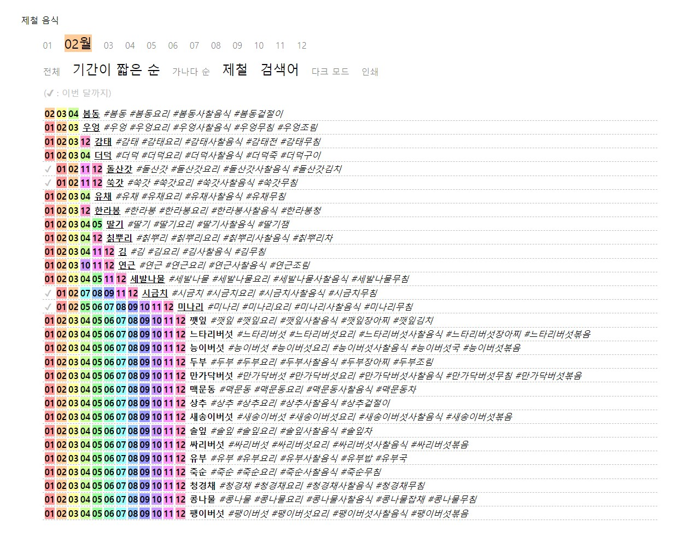

# decodingnow.github.io

제철 음식 목록입니다.  
음식들은 주로 채소와 과일입니다.  
내용이 정확하지 않을 수 있습니다.  
월을 선택해서 볼 수 있습니다.  
* "01" ~ "12" : 몇 월인지를 선택합니다. (기본값 : 현재 월)
* "전체" : 월 상관없이 모든 음식들을 보고 싶을 때 선택합니다.
* "기간이 짧은 순" : 제철 기간이 짧은 순서대로 봅니다. (기본값)
* "가나다순" : 가나다 순서대로 봅니다.
* "제철" : 제철 기간을 끄거나 켭니다. (기본값 : on)
* "검색어" : 검색어를 끄거나 켭니다. (기본값 : on)
* "다크 모드" : 다크 모드를 켜거나 끕니다. (기본값 : off)
* "인쇄" : 목록을 인쇄합니다.